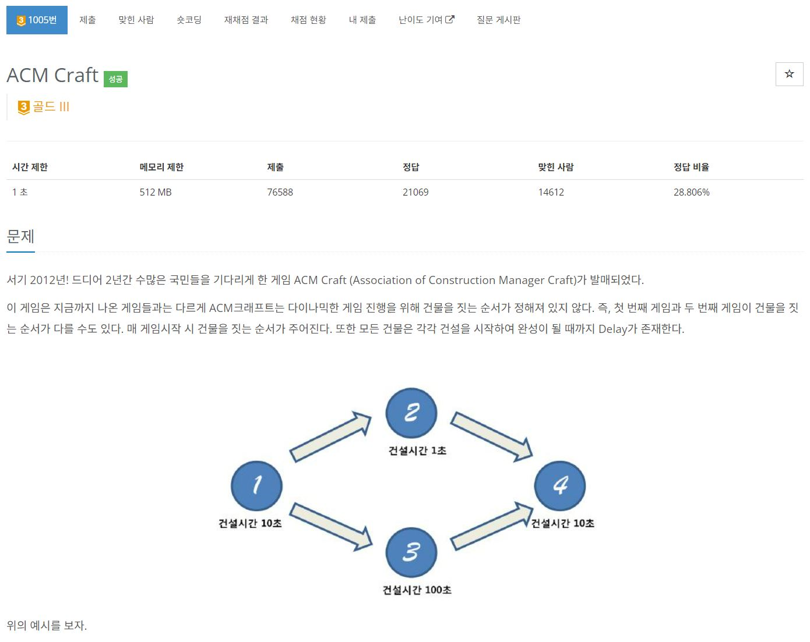

https://www.acmicpc.net/problem/1005

# 🔍 ACM Craft
- 설계 시간 : ? min
- 구현 시간 : ? min
- 난이도 : 골드 3
- 알고리즘 : 위상 정렬 / 다이나믹 프로그래밍
- 코드 길이 : 3195B
- 실행 시간 : 868ms(제한 1초)
- 메모리 : 248504KB

------------------------------

# 💡 아이디어

- 그림만 봐도 위상 정렬 냄새가 난다
- 근데 단순한 정렬 순서가 아니라 특정 노드에 대한 선행 시간을 알아내야 하는 점이 다름
- 각각의 건물에 대해 해당 건물을 완성할 때까지 걸리는 시간을 저장하는 dp 배열 선언
- 이후 갱신하면서 값을 구하면 끝

------------------------------

# ✔ 문제 풀이

- 일단 각각의 건물을 건설하는데 걸리는 시간(건물 1개)을 저장하는 배열 Darr를 준비
- 각각의 건물을 건설하는데 걸리는 최소 시간을 저장하는 배열 dp를 준비
- 이후 인접리스트 방식의 위상 정렬을 수행(이 템플릿을 기억해야해)
- 위상 정렬에서 선행 작업의 연결된 후행 작업에 대해 dp 테이블을 갱신하는게 포인트임
- 해당 건물을 건설하는데 걸리는 최소 시간 = max(현재 구해놓은 해당 건물을 건설하는데 걸리는 최소 시간, 선행 건물을 건설하는데 걸리는 최소 시간 + 해당 건물을 건설하는데 걸리는 시간)

------------------------------

# 🧠 어려웠던 점

- 위상 정렬을 대강 기억하는데로 코드를 짰었는데 시간 초과나서 다시 공부하고 풀었는데, 저렇게 구현 안하면 시간 복잡도가 이상해지는거 같다
- 위상 정렬에서 정렬 순서가 아닌 다른걸 물어보는 문제는 익숙하지 않았는데 이게 거의 끝판왕 정도인 듯

------------------------------

# 🧐 좋은 풀이

- 내가 제일 나은듯
